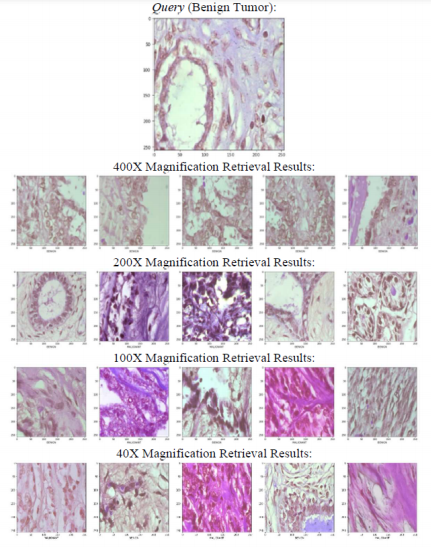

## CNN Based Autoencoder Application in Breast Cancer Image Retrieval
#### IEEE 2021 International Seminar on Intelligent Technology and Its Applications (ISITIA)
[](https://paperswithcode.com/sota/medical-image-retrieval-on-breakhis?p=cnn-based-autoencoder-application-in-breast)



### Abstract
Content Based Medical Image Retrieval (CBMIR) is considered as a common technique to retrieve relevant images by comparing the features contained in the query image with the features contained in the image located in the database. Currently, the study related to CBMIR on breast cancer image however remains challenging due to inadequate research in such area. Previous study has a low performance and misinformation emphasizing the feature extraction process. Therefore, this study aims to utilize the CNN based Autoencoder method to minimize misinformation in the feature extraction process and to improve the performance result. The dataset used in this study is the BreakHis dataset. Overall, the results of image retrieval in breast cancer applying the CNN based Autoencoder method achieved higher performance compared to the method used in the previous study with an average precision of 0.9237 in the mainclass dataset category and 0.6825 in the subclass dataset category.

### Usage
#### this is sample of flow running app based on our paper explanation
- Make sure you already installed python version at least 3.7
- Download and place dataset in same project folder
- If you have any further question don't hesitate to email at kharisma.muzaki@gmail.com
```
pip install requirements.txt
python split_image_binary.py
python split_image_multi_class.py
python training_binary_sample_400.py
python training_subclass_sample_400.py
python retrieval_sample.py
python graph_sample.py
```
### Still cumbersome
##### Don't worry we have usage with notebook example with already dataset splitted
##### - [Subclass 40X Magnification Example](notebook/Example_Usage_of_Subclass.ipynb)
##### - [Binary 40X Magnification Example](notebook/Example_Usage_of_Binary.ipynb)

### Project Structure
This is project structured are contained in this git repository
```
📦 projects
 ┣ 📂 notebook [collection notebook example usage]
 ┣ 📂 utils
 ┃ ┣ 📜 conv_auto_encoder.py [core of main model for deep learning feature extraction, you can change our model up to you]
 ┃ ┗ 📜 retrieval.py [retrival supporting code]
 ┣ 📜 core_split.py   [core support for splitting images]
 ┣ 📜 graph_sample.py     [draw chart from comparison of training]
 ┣ 📜 retrieval_sample.py     [retrieval sample on 400x Magnification]
 ┣ 📜 split_image_binary.py   [splitting images based on binary scenario]
 ┣ 📜 split_image_multi_class.py      [splitting images based on subclass from all available class]
 ┣ 📜 training_binary_sample_400.py   [training binary scenario example]
 ┗ 📜 training_subclass_sample_400.py     [training subclass scenario example]
```

### Assets
- [Full Paper Here](https://ieeexplore.ieee.org/document/9502205)
- [Dataset Source](https://web.inf.ufpr.br/vri/databases/breast-cancer-histopathological-database-breakhis/)
- [Project Raw Version on Google Drive](https://drive.google.com/drive/folders/1oQXs24X8BIA4CqllPUQTk4PWDdTbJREf?usp=sharing)

### Citation
##### If you are found any useful information from us please support by making citation based on our paper, gracias ✌
A. E. Minarno, K. M. Ghufron, T. S. Sabrila, L. Husniah and F. D. S. Sumadi, "CNN Based Autoencoder Application in Breast Cancer Image Retrieval," 2021 International Seminar on Intelligent Technology and Its Applications (ISITIA), 2021, pp. 29-34, doi: 10.1109/ISITIA52817.2021.9502205.

### TODO
- ~~Usage with python native script~~
- ~~Usage subclass with notebook~~
- ~~Usage binary scenario with notebook~~
- Deployed version as a web service

### Datapath structure used
```
binary_scenario
├── test
│   ├── 100X
│   │   ├── benign
│   │   └── malignant
│   ├── 200X
│   │   ├── benign
│   │   └── malignant
│   ├── 400X
│   │   ├── benign
│   │   └── malignant
│   └── 40X
│       ├── benign
│       └── malignant
├── train
│   ├── 100X
│   │   ├── benign
│   │   └── malignant
│   ├── 200X
│   │   ├── benign
│   │   └── malignant
│   ├── 400X
│   │   ├── benign
│   │   └── malignant
│   └── 40X
│       ├── benign
│       └── malignant
└── val
    ├── 100X
    │   ├── benign
    │   └── malignant
    ├── 200X
    │   ├── benign
    │   └── malignant
    ├── 400X
    │   ├── benign
    │   └── malignant
    └── 40X
        ├── benign
        └── malignant
```
```
subclass_scenario
├── test
│   ├── 100X
│   │   ├── adenosis
│   │   ├── ductal_carcinoma
│   │   ├── fibroadenoma
│   │   ├── lobular_carcinoma
│   │   ├── mucinous_carcinoma
│   │   ├── papillary_carcinoma
│   │   ├── phyllodes_tumor
│   │   └── tubular_adenoma
│   ├── 200X
│   │   ├── adenosis
│   │   ├── ductal_carcinoma
│   │   ├── fibroadenoma
│   │   ├── lobular_carcinoma
│   │   ├── mucinous_carcinoma
│   │   ├── papillary_carcinoma
│   │   ├── phyllodes_tumor
│   │   └── tubular_adenoma
│   ├── 400X
│   │   ├── adenosis
│   │   ├── ductal_carcinoma
│   │   ├── fibroadenoma
│   │   ├── lobular_carcinoma
│   │   ├── mucinous_carcinoma
│   │   ├── papillary_carcinoma
│   │   ├── phyllodes_tumor
│   │   └── tubular_adenoma
│   └── 40X
│       ├── adenosis
│       ├── ductal_carcinoma
│       ├── fibroadenoma
│       ├── lobular_carcinoma
│       ├── mucinous_carcinoma
│       ├── papillary_carcinoma
│       ├── phyllodes_tumor
│       └── tubular_adenoma
├── train
│   ├── 100X
│   │   ├── adenosis
│   │   ├── ductal_carcinoma
│   │   ├── fibroadenoma
│   │   ├── lobular_carcinoma
│   │   ├── mucinous_carcinoma
│   │   ├── papillary_carcinoma
│   │   ├── phyllodes_tumor
│   │   └── tubular_adenoma
│   ├── 200X
│   │   ├── adenosis
│   │   ├── ductal_carcinoma
│   │   ├── fibroadenoma
│   │   ├── lobular_carcinoma
│   │   ├── mucinous_carcinoma
│   │   ├── papillary_carcinoma
│   │   ├── phyllodes_tumor
│   │   └── tubular_adenoma
│   ├── 400X
│   │   ├── adenosis
│   │   ├── ductal_carcinoma
│   │   ├── fibroadenoma
│   │   ├── lobular_carcinoma
│   │   ├── mucinous_carcinoma
│   │   ├── papillary_carcinoma
│   │   ├── phyllodes_tumor
│   │   └── tubular_adenoma
│   └── 40X
│       ├── adenosis
│       ├── ductal_carcinoma
│       ├── fibroadenoma
│       ├── lobular_carcinoma
│       ├── mucinous_carcinoma
│       ├── papillary_carcinoma
│       ├── phyllodes_tumor
│       └── tubular_adenoma
└── val
    ├── 100X
    │   ├── adenosis
    │   ├── ductal_carcinoma
    │   ├── fibroadenoma
    │   ├── lobular_carcinoma
    │   ├── mucinous_carcinoma
    │   ├── papillary_carcinoma
    │   ├── phyllodes_tumor
    │   └── tubular_adenoma
    ├── 200X
    │   ├── adenosis
    │   ├── ductal_carcinoma
    │   ├── fibroadenoma
    │   ├── lobular_carcinoma
    │   ├── mucinous_carcinoma
    │   ├── papillary_carcinoma
    │   ├── phyllodes_tumor
    │   └── tubular_adenoma
    ├── 400X
    │   ├── adenosis
    │   ├── ductal_carcinoma
    │   ├── fibroadenoma
    │   ├── lobular_carcinoma
    │   ├── mucinous_carcinoma
    │   ├── papillary_carcinoma
    │   ├── phyllodes_tumor
    │   └── tubular_adenoma
    └── 40X
        ├── adenosis
        ├── ductal_carcinoma
        ├── fibroadenoma
        ├── lobular_carcinoma
        ├── mucinous_carcinoma
        ├── papillary_carcinoma
        ├── phyllodes_tumor
        └── tubular_adenoma
```
